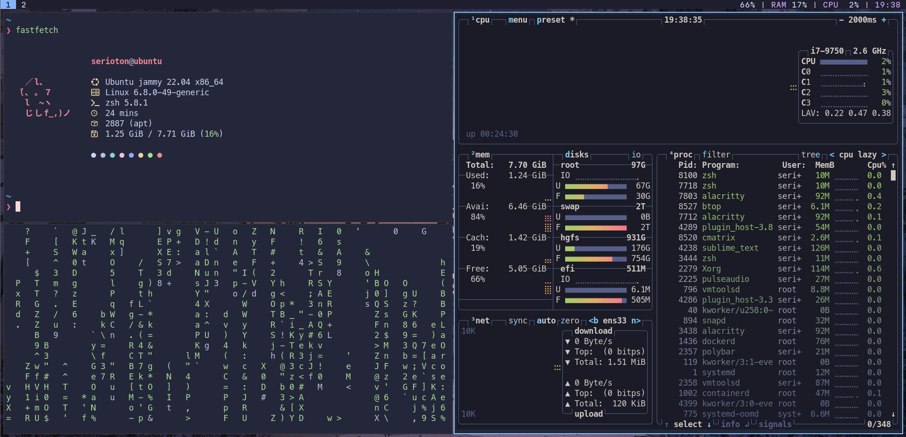

# Dotfiles
This repo contains my dotfile configuration<br>
Inspired by: https://github.com/xct/kali-clean

## Installation
```
$ git clone https://github.com/seriotonctf/dotfiles
```
```
$ cd dotfiles
```
```
$ chmod +x install.sh
```
Make sure you have a sudo token
```
$ sudo whoami
```
Run
```
$ ./install.sh
```
The installation script will do the following:
- Install Dependencies
- Install Nerd Fonts
- Install Alacritty
- Install i3
- Copy configs to the `~/.config` directory
- Configure tmux
- Install ohmyzsh<br>

It may take a while to setup everything
## After The Installation
- Reboot
- Select i3 (top right corner) on the login screen
- Open a terminal `windows+return`
- Run `lxappearance` 
- Select the `Ark-Dark` theme
- Change the icons to `Papirus-Dark`

## Customization
- If you want to change the wallpaper, edit the `~/.fehbg` file with the path to your wallpaper<br>
- All configurations are located in `~/.config`. Feel free to tailor them to your preferences
## Look

